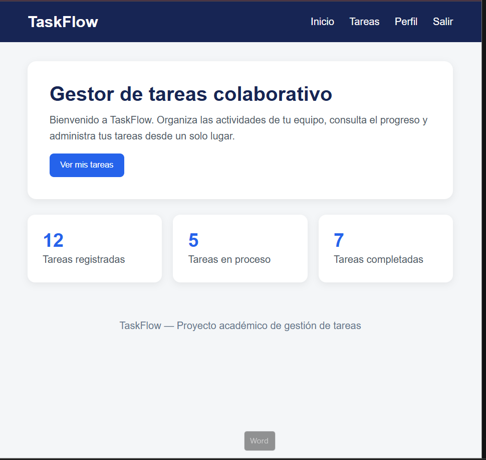
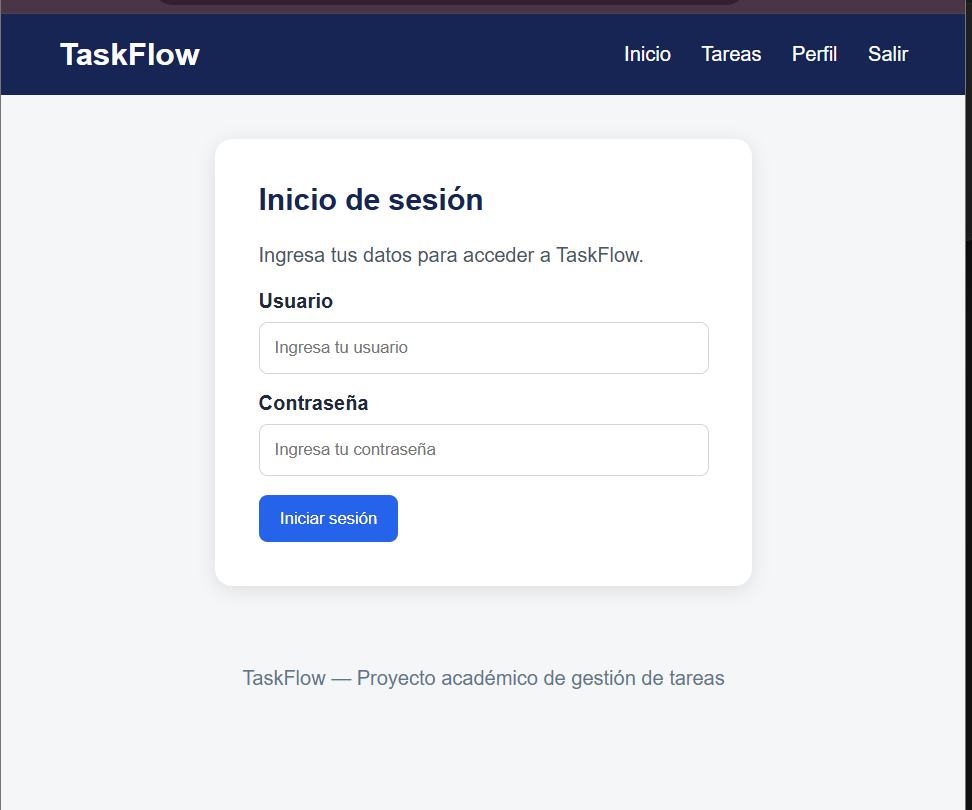
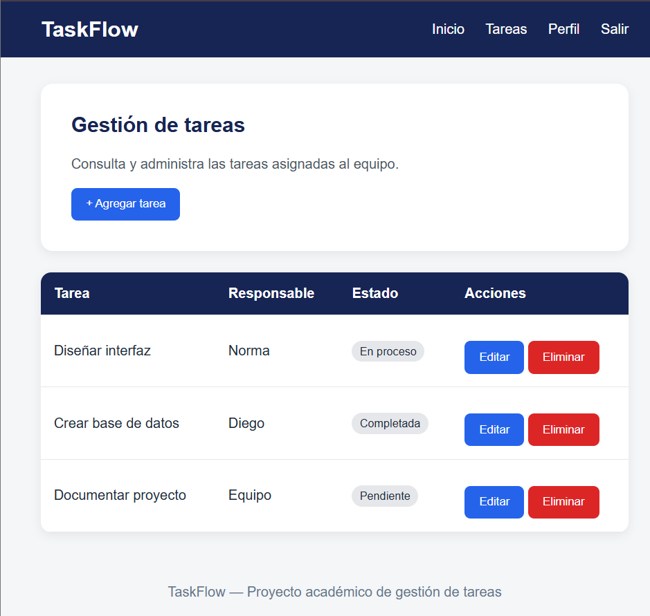
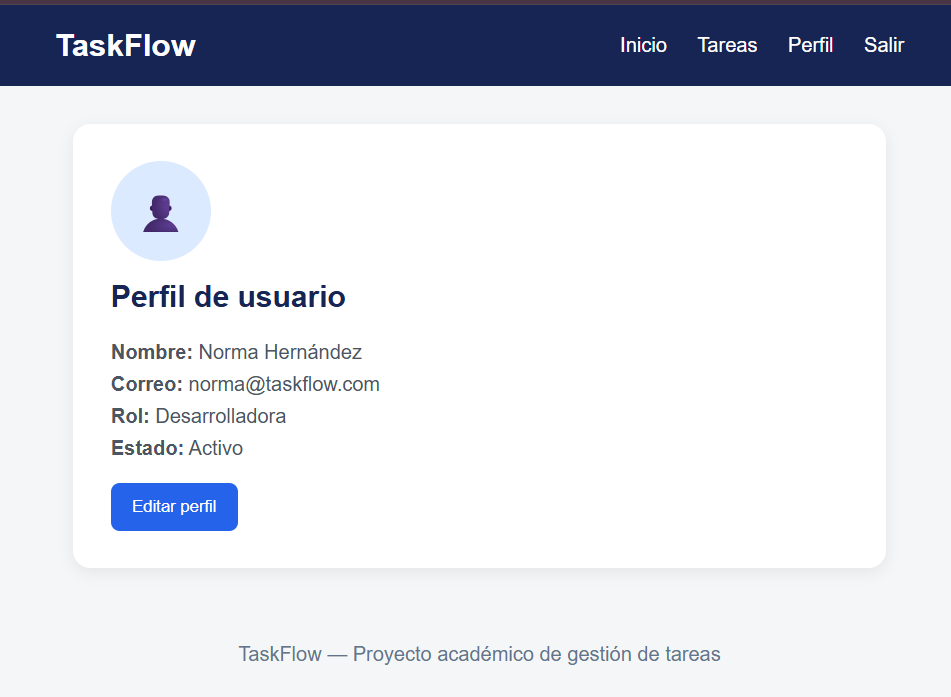
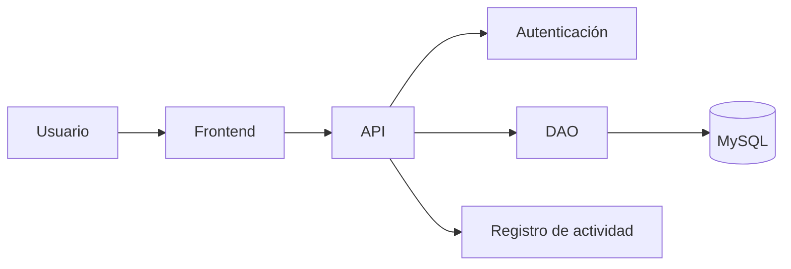

#  TaskFlow


##Descripción 

TaskFlow es una aplicación colaborativa para gestionar tareas de equipos de trabajo.

## Tabla de contenidos

- Descripción 
- Funcionalidades
- Requisitos
- Instalación
- Uso 
- Capturas de pantalla
- Arquitectura
- Estructura del proyecto
- Contribuidores
- Licencia

## Funcionalidades

- Crear tareas 
- Editar tareas
- Eliminar  tareas
- Asignar responsables
- Marcar tareas como completadas

### Checklist 

- [x] Crear tareas
- [x] Editar tareas
- [x] Eliminar tareas
- [ ] Notificaciones
- [ ] Modo oscuro

## Tecnologías utilizadas

| Tecnología | Uso |
|------------|----------------|
| HTML | Interfaz |
| CSS | Diseño |
| JavaScript | Lógica |
| MySQL | Base de datos |

## Requisitos 

- Visual Studio Code 
- Navegador modedrno 
- Git
- MySQL 

### Instalación 

```bash
git clone https://github.com/usuario/taskflow.git
cd taskflow
npm install
npm start
```

## Uso 

1.  Iniciar lal aplicación.
2. Crear una cuenta.
3. Agregar una tarea.
4. Administrar el pprogreso del equipo.

## Capturas de pantalla 

### Pantalla principal 


### Inicio de sesión


### Gestión de tareas


### Perfil de usuario


###  Arquitectura



## Estructura del proyecto

```text
TaskFlow/
│── README.md
│── src/
│── css/
│── js/
│── images/
│── database/
```

## Contribuidores 

- Shammel Hernández
- Equipo TaskFlow

## Licencia

Este proyecto utiliza la licecncia MIT. 